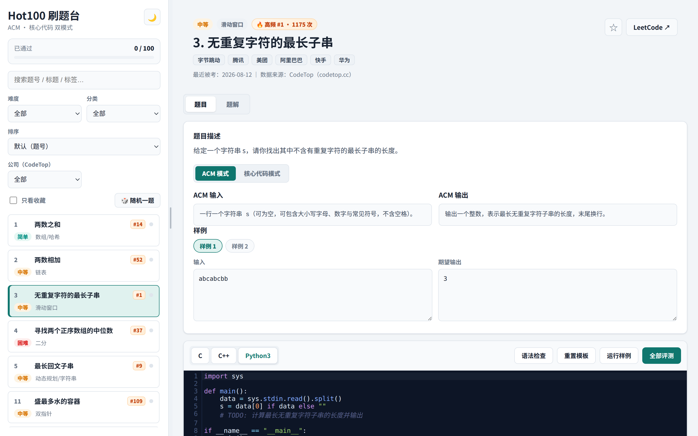
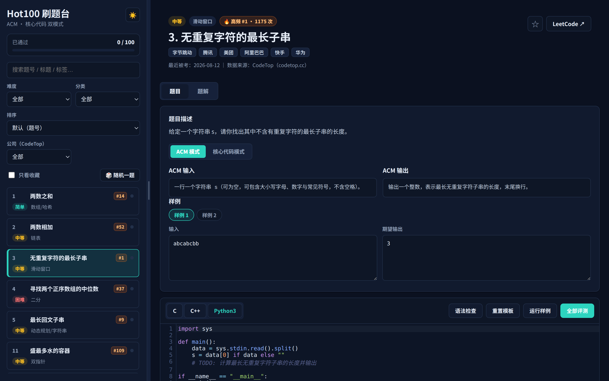
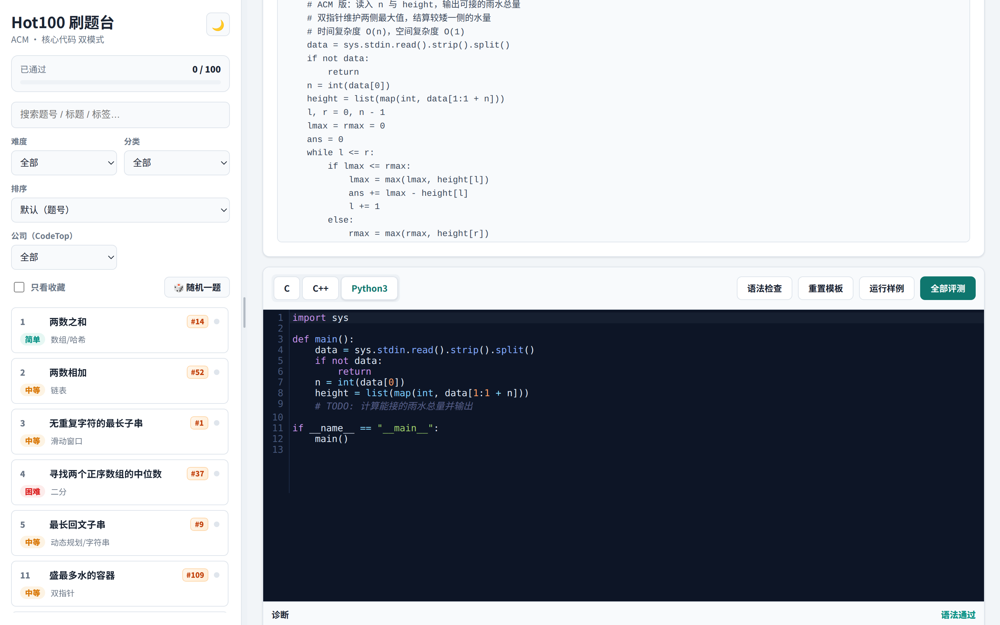
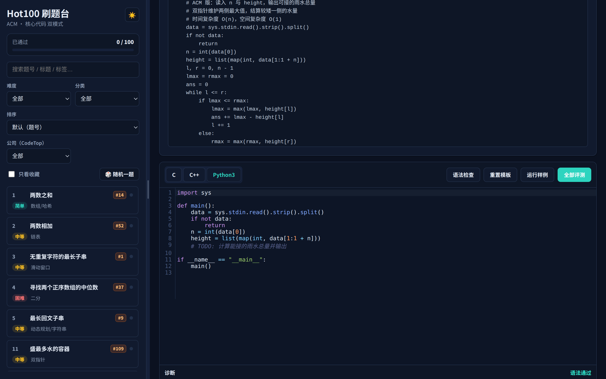

<div align="center">

# 🔥 Hot100 刷题台

**本地运行的 LeetCode Hot 100 刷题工作台 · 面试备战神器**

> 双模式评测（ACM + 核心代码）｜ 100 题完整题库 ｜ 400 份带注释参考题解 ｜ CodeTop 高频/公司数据
> 面向秋招、春招、实习 —— 刷题不闭门造车，直击大厂高频考点

[](https://github.com/Hubert-hwk/hot100-judge/stargazers)
[](https://github.com/Hubert-hwk/hot100-judge/actions)
[](LICENSE)
[](https://github.com/Hubert-hwk/hot100-judge)
[](https://github.com/Hubert-hwk/hot100-judge)

</div>

---

## ✨ 为什么值得一试？

LeetCode 刷题最大的痛点：**不知道重点、做完没有反馈、答案看不懂**。这个项目一次性解决：

| 🎯 痛点 | ✅ 解决方案 |
|---|---|
| 不知道哪些题高频、哪些公司爱考 | **CodeTop 高频数据**：100 题全部标注排名、出现次数、最近被考日期、22 家常考公司，可按公司筛选 |
| 只会 LeetCode 函数题，面试却让写完整程序 | **ACM + 核心代码双模式**，一套环境两种练法 |
| 写完不知道对不对 | **一键全部评测**，959 组测试用例逐条对比期望/实际 |
| 看题解看不懂 | **400 份中文注释题解 + 💡 解题思路讲解**（算法要点 + 复杂度） |
| 没反馈、没记录 | **进度追踪 + 错题本收藏 + 随机刷题**，本地自动保存 |

**纯本地运行、零依赖（除 Node + 本机编译器）、数据完整离线可用** —— 面试前突击，这一个就够了。

---

## 📸 界面预览

| 亮色 · 主界面 | 暗色 · 主界面 |
|---|---|
|  |  |

| 题解页 · 解题思路 + 注释代码 | 暗色 · 题解页 |
|---|---|
|  |  |

> 支持 `?problem=<题号>&view=solution&theme=dark` 深度链接，可分享任意题目。

---

## 🚀 30 秒上手

```bash
git clone https://github.com/Hubert-hwk/hot100-judge.git
cd hot100-judge
npm start
# 浏览器打开 http://localhost:5173
```

依赖：Node.js ≥ 18 + 本机 `python3` / `gcc` / `g++`（用于评测，CI 已保证兼容性）。

---

## 🧩 核心功能

### 🎮 双模式评测
题目页一键切换：
- **ACM 模式**：写完整程序，读 stdin、写 stdout —— 还原面试手写全流程
- **核心代码模式**：只写函数/类（`def twoSum(...)` / `class Solution {...}`），评测器自动构造**链表/树/矩阵/随机指针/相交链表**等复杂参数并注入驱动，一次编译跑完所有用例

### 📊 CodeTop 高频数据
- 每道题标注：🔥 高频榜排名、出现次数、**最近被考日期**、常考公司标签
- 侧边栏按 **公司筛选**（如"小红书 36 题"）、按**热度排序**
- 数据来自 [CodeTop](https://codetop.cc) 公开接口，可一键重建

### 📚 内容规模
| 内容 | 数量 |
|---|---|
| 题目（Hot 100 全量） | 100 |
| ACM + 核心代码测试用例 | **959 组** |
| 参考题解（Python3/C++ × 核心/ACM） | **400 份**，全部带中文注释 |
| 解题思路讲解 | 100/100 题 |

### 🛠 工程体验
- CodeMirror 编辑器：语法高亮 / 行号 / 括号匹配 / 自动缩进
- 评测资源限制（CPU 5s / 内存 512MB / 输出 64KB）+ 浮点容差
- 明暗主题、快捷键（`Ctrl+Enter` 评测 / `Ctrl+S` 保存）
- 进度条、收藏（错题本）、随机一题、深度链接分享
- **GitHub Actions CI**：每次推送自动全量验证 100 题 × 4 项评测

---

## 📖 技术架构

```
server.js                  HTTP 服务 + /api/run /api/check /api/judge
judge/
  runner.js                进程执行（编译/运行、资源限制）
  core-driver.js           ★ 核心代码模式驱动生成器（链表/树/矩阵序列化与比较）
  judge.js                 ACM 评测、核心代码评测、输出对比
public/
  index.html/styles.css/app.js   前端（CodeMirror、双模式、题解、进度）
  data/                    题库/用例/题解/CodeTop 数据（JSON，可离线）
  vendor/codemirror/       CodeMirror 5（本地离线）
scripts/                   数据构建、验证、抓取 CodeTop 数据、端到端测试
.github/workflows/ci.yml   CI：推送即全量验证
```

**驱动注入**是核心亮点：核心代码模式下，评测器生成一段包含"数据序列化 + 用户函数 + 测试执行器"的驱动源码，一次编译跑完全部用例 —— 链表用 `list:[1,2,3]`、树用 `tree:[...]`、带环链表用 `cycleList:[...]` 等记号表示。

---

## 🔄 数据维护

```bash
node scripts/fetch-codetop.js       # 抓取 CodeTop 公开数据（限流自动退避）
node scripts/build-codetop-data.js  # 构建高频/公司数据 → problems.json
node scripts/add-explains.js        # 合并解题思路讲解
node scripts/verify-parts.js all    # 全量验证（100 题 × 4 项真实编译运行）
node scripts/e2e.js --all           # HTTP 端到端测试（400 项）
```

---

## 🤝 参与贡献

欢迎任何形式的贡献：**Star ⭐、Issue、PR**。

- 想加题目/用例/题解：参考 `work/DATA_SCHEMA.md` 的格式，改完跑 `node scripts/verify-parts.js all`
- 想修 bug / 加功能：直接提 PR，CI 会自动验证
- 数据致谢：[CodeTop](https://codetop.cc)

**如果这个项目对你有帮助，请点个 ⭐ Star —— 你的支持是最大的动力！**

---

## ⚠️ 安全提示

评测服务会在本机直接编译并运行你提交的代码（仅限本地工具使用），请勿将此服务暴露到公网；如需远程使用，应在隔离容器/沙箱中运行。

## 📄 License

[MIT](LICENSE) © Hubert-hwk
